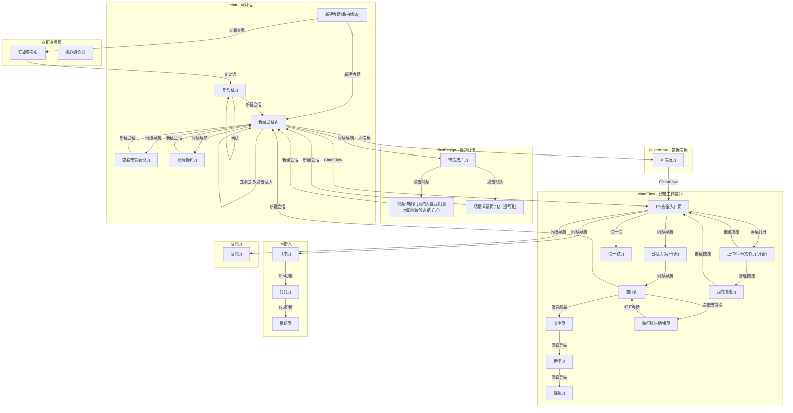

# 蝉妈妈AI - 交互蓝图智能清洗

## 1. 项目概览

本蓝图基于 Web to UX 采集的 43 个页面状态和 106 个交互步骤生成，覆盖 **chat（AI对话）**、**filmDesign（视频创作）**、**立即查看页（数据分析报告）**、**dashboard（数据看板）**、**chanClaw（智能工作空间）**、**官网页** 等核心模块。已采集页面包括新建会话页、查看带货表现页、账号拆解页、带货成片页、AI看板页、文件页、创作页、视频页、日程页、IM接入页、技能管理页等。

**未采集、未点击或未展开的入口不在本蓝图范围内**，不能视为原系统已有能力。例如“浏览器插件”、“闽公网安备”、“蝉妈妈数据平台”等底部链接未点击，其目标页面和交互未知。

## 2. 全站模块地图

| 模块 | 模块用途 | 主入口 | 核心业务对象 | 未确认入口 |
|------|----------|--------|--------------|------------|
| **chat** | AI对话分析：新建会话、查看带货表现、账号拆解、新对话 | 新建会话页、查看带货表现页、账号拆解页、新对话页 | 会话列表、对话内容 | 浏览器插件、底部链接 |
| **filmDesign** | AI视频创作：带货成片、视频详情查看 | 带货成片页、视频详情页（真的太懂我们夏天怕闷捂的女孩子了、1亿+透气孔） | 视频成片、视频参数 | 浏览器插件、底部链接 |
| **立即查看页** | 数据分析报告：核心结论、销售概览、品类表现 | 立即查看页（从新建会话进入） | 核心结论、表格数据 | 商品链接、专场链接 |
| **dashboard** | AI可视化看板：对象分析、问题追踪 | AI看板页（从新建会话页进入） | 分析对象、分析问题 | 添加问题、添加对象、导出 |
| **chanClaw** | 智能工作空间：对话、日程、空间、文件、创作、IM接入、技能管理 | 1个安全入口页（从chat/dashboard进入） | 选品分析、文件、日程、技能 | 浏览器插件、底部链接 |
| **创作页** | 创作内容管理：全部、图片、视频 | 创作页（从文件页进入） | 创作内容列表 | 浏览器插件、底部链接 |
| **视频页** | 视频内容管理：视频、图片 | 视频页（从文件页进入） | 视频内容列表 | 浏览器插件、底部链接 |
| **飞书/钉钉/微信页** | IM接入管理：飞书、钉钉、微信Tab切换 | 飞书页（从chanClaw进入） | IM接入配置 | 浏览器插件、底部链接 |
| **官网页** | 产品官网：功能介绍、适用人群 | 官网页（从chanClaw进入） | 产品介绍、适用人群 | 首页、学习中心、下载中心 |

## 3. 功能层级地图

```
蝉妈妈AI
├── chat（AI对话）
│   ├── 新建会话页（含Tab：带货视频/作者风格/带货商品）
│   ├── 查看带货表现页
│   ├── 账号拆解页
│   ├── 新对话页
│   └── 新建会话（路由状态）
├── filmDesign（视频创作）
│   ├── 带货成片页
│   ├── 视频详情页（真的太懂我们夏天怕闷捂的女孩子了）
│   └── 视频详情页（1亿+透气孔）
├── 立即查看页
│   └── 核心结论 🎯（含Tab：商品/专场/品类）
├── dashboard（数据看板）
│   └── AI看板页（含分析对象Tab）
├── chanClaw（智能工作空间）
│   ├── 1个安全入口页（含Tab：描述需求/AI生成/创建技能）
│   ├── 日程页（月/今天/列表Tab）
│   ├── 空间页（对话 日程 空间 记忆 接入IM ChanClaw 工作空间 文件 创作页）
│   ├── 文件页（含品类分析表格）
│   ├── 创作页（全部/图片/视频Tab）
│   ├── 视频页（视频/图片Tab）
│   ├── 骑行服热销榜页
│   ├── 试一试页
│   ├── 上传Skills文件页（弹窗）
│   └── 我的技能页（全部/订阅/我创建的Tab）
├── IM接入
│   ├── 飞书页（飞书/钉钉/微信Tab）
│   ├── 钉钉页（飞书/钉钉/微信Tab）
│   └── 微信页（飞书/钉钉/微信Tab）
└── 官网页
    └── 电商运营（适用人群Tab）
```

## 4. 页面结构索引

| 页面名称 | 所属模块 | 详情线索 |
|----------|----------|----------|
| 新建会话页 | chat | 含Tab：带货视频/作者风格/带货商品；含按钮：立即提取、提取视频文案 |
| 查看带货表现页 | chat | 路由：/chat?cid=2792589 |
| 账号拆解页 | chat | 路由：/chat?cid=2792592 |
| 新对话页 | chat | 含按钮：确认、新建会话 |
| 带货成片页 | filmDesign | 路由：/filmDesign；含按钮：脑洞广告 |
| 视频详情页（真的太懂我们夏天怕闷捂的女孩子了） | filmDesign | 含列表：视频形式、成片时长、视频比例、创作思路 |
| 视频详情页（1亿+透气孔） | filmDesign | 含列表：品牌名称、产品名称、产品卖点 |
| 立即查看页 | 立即查看页 | 含区域：核心结论、销售概览、品类表现、商品表现、带货方式、流量结构 |
| AI看板页 | dashboard | 含表格：对象/分析问题；含Tab：分析对象列表 |
| 1个安全入口页 | chanClaw | 含区域：选品分析；含按钮：创建技能、上传Skills文件 |
| 日程页（月） | chanClaw | 含表格：日历日期；含Tab：月/今天/列表 |
| 空间页 | chanClaw | 含列表：文件列表（分页） |
| 文件页 | chanClaw | 含表格：品类分析（日期/达人数量/直播数量/销量/销售额等） |
| 创作页 | chanClaw | 含Tab：全部/图片/视频 |
| 视频页 | chanClaw | 含Tab：视频/图片 |
| 骑行服热销榜页 | chanClaw | 含表格：热销商品榜（名称/排名/销量/销售额等） |
| 试一试页 | chanClaw | 含表单：内容洞察输入框 |
| 上传Skills文件页 | chanClaw | 弹窗；含表单：创建技能；含按钮：取消/确定 |
| 我的技能页 | chanClaw | 含Tab：全部/订阅/我创建的；含按钮：创建技能 |
| 飞书/钉钉/微信页 | IM接入 | 含Tab：飞书/钉钉/微信 |
| 官网页 | 官网页 | 含区域：产品介绍、适用人群Tab（电商运营/电商媒介/直播运营等） |

> **入口地图、页面字段、表格列名、表单、Tab、弹窗/抽屉等详细信息请查阅蓝图详情文件（blueprint-details.md）。**

## 5. 核心交互路径

### 路径1：AI对话分析流程
```
新建会话页 → 点击“查看带货表现” → 查看带货表现页 → 点击“新建会话” → 新建会话页
新建会话页 → 点击“账号拆解” → 账号拆解页 → 点击“新建会话” → 新建会话页
新建会话页 → 点击“立即提取” → 新建会话页（局部刷新）
新建会话页 → 点击“提取视频文案” → 新建会话页（状态变更）
```

### 路径2：数据分析报告流程
```
新建会话（路由状态） → 点击“立即查看” → 立即查看页（含核心结论、销售概览、品类表现）
立即查看页 → 点击“新对话” → 新对话页
新对话页 → 点击“确认” → 新对话页（局部刷新）
新对话页 → 点击“新建会话” → 新建会话页
```

### 路径3：AI看板与智能工作空间
```
新建会话页 → 点击“AI看板” → AI看板页
AI看板页 → 点击“ChanClaw” → 1个安全入口页（chanClaw）
新建会话页 → 点击“ChanClaw” → 1个安全入口页（chanClaw）
```

### 路径4：视频创作流程
```
新建会话页 → 点击“带货成片” → 带货成片页
带货成片页 → 点击“脑洞广告” → 带货成片页（局部刷新）
带货成片页 → 点击视频详情 → 视频详情页（真的太懂我们夏天怕闷捂的女孩子了/1亿+透气孔）
视频详情页 → 点击“新建会话” → 新建会话页
```

### 路径5：智能工作空间导航
```
1个安全入口页 → 点击“日程” → 月页 → 点击“今天” → 今天页 → 点击“空间” → 空间页
空间页 → 点击文件 → 文件页（品类分析）
文件页 → 点击“创作” → 创作页 → 点击“视频” → 视频页
空间页 → 点击“骑行服近30天热销榜” → 骑行服热销榜页
空间页 → 点击“新建会话” → 新建会话页
```

### 路径6：IM接入与技能管理
```
1个安全入口页 → 点击“接入IM” → 飞书页（飞书/钉钉/微信Tab切换）
1个安全入口页 → 点击“上传Skills文件” → 上传Skills文件页（弹窗）
上传Skills文件页 → 点击“创建技能” → 关闭弹窗返回1个安全入口页
上传Skills文件页 → 点击“管理技能” → 我的技能页
我的技能页 → 点击“全部/订阅/我创建的” → 我的技能页（Tab切换）
我的技能页 → 点击“创建技能” → 1个安全入口页
```

### 路径7：官网访问
```
1个安全入口页 → 点击“官网” → 官网页（电商运营Tab）
```

## 6. 页面关系图



## 7. 关系明细表

| 起点 | 终点 | 关系类型 | 触发入口 | 触发方式 | 状态变化 | 是否保留原状态 | 返回方式 | 判断证据 |
|------|------|----------|----------|----------|----------|----------------|----------|----------|
| 新建会话页 | 查看带货表现页 | 同级导航切换 | 查看带货表现 | 点击Tab | 新页面 | 保留同级导航上下文 | 点击其他Tab | Tab角色、URL变化 |
| 新建会话页 | 账号拆解页 | 同级导航切换 | 账号拆解 | 点击Tab | 新页面 | 保留同级导航上下文 | 点击其他Tab | Tab角色、URL变化 |
| 新建会话页 | 带货成片页 | 同级导航切换 | 带货成片 | 点击Tab | 新页面 | 保留同级导航上下文 | 点击其他Tab | Tab角色、URL变化 |
| 新建会话页 | 新建会话页 | Tab切换 | 带货视频/作者风格/带货商品 | 点击Tab | Tab切换 | 保留同级导航上下文 | 点击其他Tab | Tab角色 |
| 新建会话页 | 新建会话页 | 状态变更 | 陈翔六点半/疯狂小杨哥/粉丝数 | 点击 | 局部内容刷新 | 未确认 | 返回上一页面 | 用户录制点击 |
| 新建会话页 | 新建会话页 | 状态变更 | 立即提取 | 点击按钮 | 局部内容刷新 | 未确认 | 返回上一页面 | 按钮角色 |
| 新建会话页 | 新建会话页 | 状态变更 | 提取视频文案 | 点击 | 状态变更 | 未确认 | 返回上一页面 | 用户录制点击 |
| 查看带货表现页 | 新建会话页 | 页面进入 | 新建会话 | 点击 | 新页面 | 未确认 | 返回上一页面 | URL变化 |
| 账号拆解页 | 新建会话页 | 页面进入 | 新建会话 | 点击 | 新页面 | 未确认 | 返回上一页面 | URL变化 |
| 新建会话(路由) | 立即查看页 | 详情查看 | 立即查看 | 点击 | 新页面 | 未确认 | 返回上一页面 | URL变化 |
| 立即查看页 | 新对话页 | 页面进入 | 新对话 | 点击 | 新页面 | 未确认 | 返回上一页面 | URL变化 |
| 新对话页 | 新对话页 | 状态变更 | 确认 | 点击按钮 | 局部内容刷新 | 未确认 | 返回上一页面 | 按钮角色 |
| 新对话页 | 新建会话页 | 页面进入 | 新建会话 | 点击 | 新页面 | 未确认 | 返回上一页面 | URL变化 |
| 新建会话页 | AI看板页 | 页面进入 | AI看板 | 点击 | 新页面 | 未确认 | 返回上一页面 | URL变化 |
| AI看板页 | 1个安全入口页 | 页面进入 | ChanClaw | 点击 | 新页面 | 未确认 | 返回上一页面 | URL变化 |
| 新建会话页 | 1个安全入口页 | 页面进入 | ChanClaw | 点击 | 新页面 | 未确认 | 返回上一页面 | URL变化 |
| 1个安全入口页 | 日程页(月) | 同级导航切换 | 日程 | 点击Tab | 同级导航切换 | 保留同级导航上下文 | 点击其他Tab | 同级导航、URL变化 |
| 日程页(月) | 今天页 | 同级导航切换 | 今天 | 点击Tab | 同级导航切换 | 保留同级导航上下文 | 点击其他Tab | 同级导航、URL变化 |
| 今天页 | 空间页 | 同级导航切换 | 空间 | 点击Tab | 同级导航切换 | 保留同级导航上下文 | 点击其他Tab | 同级导航、URL变化 |
| 空间页 | 文件页 | 筛选刷新 | 点击文件 | 点击 | 当前页路由变化 | 未确认 | 返回上一页面 | 用户录制点击 |
| 文件页 | 创作页 | 同级导航切换 | 创作 | 点击Tab | 同级导航切换 | 保留同级导航上下文 | 点击其他Tab | Tab角色 |
| 创作页 | 视频页 | 同级导航切换 | 视频 | 点击Tab | 同级导航切换 | 保留同级导航上下文 | 点击其他Tab | Tab角色 |
| 空间页 | 骑行服热销榜页 | 页面进入 | 骑行服近30天热销榜 | 点击 | 当前页路由变化 | 未确认 | 返回上一页面 | 用户录制点击 |
| 骑行服热销榜页 | 空间页 | 页面进入 | 骑行服近30天热销榜 打开会话 | 点击 | 当前页路由变化 | 未确认 | 返回上一页面 | 用户录制点击 |
| 空间页 | 新建会话页 | 页面进入 | 新建会话 | 点击 | 新页面 | 未确认 | 返回上一页面 | URL变化 |
| 1个安全入口页 | 试一试页 | 页面进入 | 试一试 | 点击按钮 | 当前页路由变化 | 未确认 | 返回上一页面 | 按钮角色 |
| 1个安全入口页 | 上传Skills文件页 | 浮层打开 | 上传Skills文件 | 点击 | 弹窗打开 | 保留原页面状态 | 点击创建技能/管理技能 | 出现浮层 |
| 上传Skills文件页 | 1个安全入口页 | 表单操作 | 创建技能 | 点击按钮 | 关闭弹窗 | 未确认 | 返回上一页面 | 按钮角色 |
| 上传Skills文件页 | 我的技能页 | 返回退出 | 管理技能 | 点击 | 关闭弹窗 | 未确认 | 返回上一页面 | 用户录制点击 |
| 我的技能页 | 我的技能页 | 同级导航切换 | 全部/订阅/我创建的 | 点击Tab | Tab切换 | 保留同级导航上下文 | 点击其他Tab | Tab角色 |
| 我的技能页 | 1个安全入口页 | 表单操作 | 创建技能 | 点击 | 当前页路由变化 | 未确认 | 返回上一页面 | 用户录制点击 |
| 1个安全入口页 | 飞书页 | 同级导航切换 | 接入IM | 点击Tab | 同级导航切换 | 保留同级导航上下文 | 点击其他Tab | 同级导航、URL变化 |
| 飞书页 | 钉钉页 | 同级导航切换 | 钉钉 | 点击Tab | Tab切换 | 保留同级导航上下文 | 点击其他Tab | Tab角色 |
| 钉钉页 | 微信页 | 同级导航切换 | 微信 | 点击Tab | Tab切换 | 保留同级导航上下文 | 点击其他Tab | Tab角色 |
| 1个安全入口页 | 官网页 | 同级导航切换 | 官网 | 点击链接 | 同级导航切换 | 保留同级导航上下文 | 点击其他Tab | 同级导航、URL变化 |
| 带货成片页 | 视频详情页 | 页面进入 | 点击视频 | 点击 | 新页面 | 未确认 | 返回上一页面 | URL变化 |
| 视频详情页 | 新建会话页 | 页面进入 | 新建会话 | 点击 | 新页面 | 未确认 | 返回上一页面 | URL变化 |

## 8. 蓝图缺口与待校对信息

### 未点击入口（存在但未确认到达结果）
- **浏览器插件**：出现在多个页面底部，未点击
- **闽公网安备/闽ICP备**：底部备案链接，未点击
- **蝉妈妈，/蝉妈妈数据平台**：底部品牌链接，未点击
- **心相印悬挂式抽纸/康师傅15袋泡面组合**：立即查看页商品链接，未点击
- **心相印纸巾专场1/康师傅专场1**：立即查看页专场链接，未点击
- **添加问题/添加对象/导出**：AI看板页按钮，未点击
- **创建定时任务**：日程页按钮，未点击
- **下一页**：空间页/文件页分页，未点击
- **首页/学习中心/下载中心**：官网页导航，未点击

### 自动补采跳过的高风险入口
- 无自动补采跳过记录

### 疑似但未确认模块
- **选品分析**：出现在1个安全入口页的区域标题，但未作为独立模块采集，其完整功能未知
- **品类分析_按自定义商品关键词查询**：文件页的表格名称，可能是一个独立的数据分析功能模块

### 只看到入口但未看到结果的操作
- **立即提取**：点击后局部刷新，但未采集刷新后的具体内容
- **提取视频文案**：点击后状态变更，但未采集变更后的具体内容
- **创建技能**：点击后返回1个安全入口页，但未采集技能创建表单的完整流程
- **试一试**：点击后进入试一试页，但未采集AI生成结果的具体展示

### 接口线索但未确认页面关系
- 路由 `/chat?cid=xxx` 表示会话ID，但未采集会话列表页
- 路由 `/filmDesign?cid=xxx` 表示视频ID，但未采集视频列表页
- 路由 `/chanClaw/schedule` 表示日程，但未采集日程详情页
- 路由 `/dashboard/64` 表示看板ID，但未采集看板配置页

## 9. 给AI的需求落位上下文

**设计执行摘要：**

本蓝图是蝉妈妈AI旧系统的交互地图，覆盖 **AI对话分析（chat）**、**视频创作（filmDesign）**、**数据看板（dashboard）**、**智能工作空间（chanClaw）**、**IM接入** 和 **官网** 六大模块。已采集43个页面状态和106个交互步骤。

**执行新需求时，请遵循以下原则：**

1. **当前需求优先**：只抽取与该需求直接相关的模块、入口、页面状态和返回路径。无关模块只作为背景，不要展开设计。

2. **关键入口参考**：
   - 新建会话页（chat）是核心入口，可通过Tab切换进入查看带货表现、账号拆解、带货成片
   - 1个安全入口页（chanClaw）是智能工作空间的核心入口，可进入日程、空间、文件、创作、IM接入、技能管理
   - AI看板页（dashboard）是数据可视化入口，可进入chanClaw

3. **页面关系要点**：
   - chat模块内部：新建会话页 ↔ 查看带货表现页/账号拆解页（同级导航）
   - chat → filmDesign：新建会话页 → 带货成片页（同级导航）
   - chat → 报告：新建会话 → 立即查看页（详情查看）
   - chat → dashboard：新建会话页 → AI看板页（页面进入）
   - chat/ dashboard → chanClaw：通过“ChanClaw”入口进入1个安全入口页
   - chanClaw内部：1个安全入口页 → 日程/空间/文件/创作/IM/技能（同级导航）

4. **返回路径**：
   - 同级导航切换：点击其他Tab返回
   - 新页面：通过“新建会话”或浏览器返回
   - 弹窗：通过“创建技能”或“管理技能”关闭

5. **边界说明**：
   - 未采集的入口（浏览器插件、底部链接、商品链接等）不能当作原系统已有能力
   - 未点击的按钮（添加问题、导出、创建定时任务等）其交互结果未知
   - 本蓝图只代表已采集范围，新需求如需这些能力，应作为新增入口或新增状态设计

**设计AI请以用户当前需求为最高优先级，只抽取相关模块和页面关系，不要因为蓝图完整就展开全站设计。**
